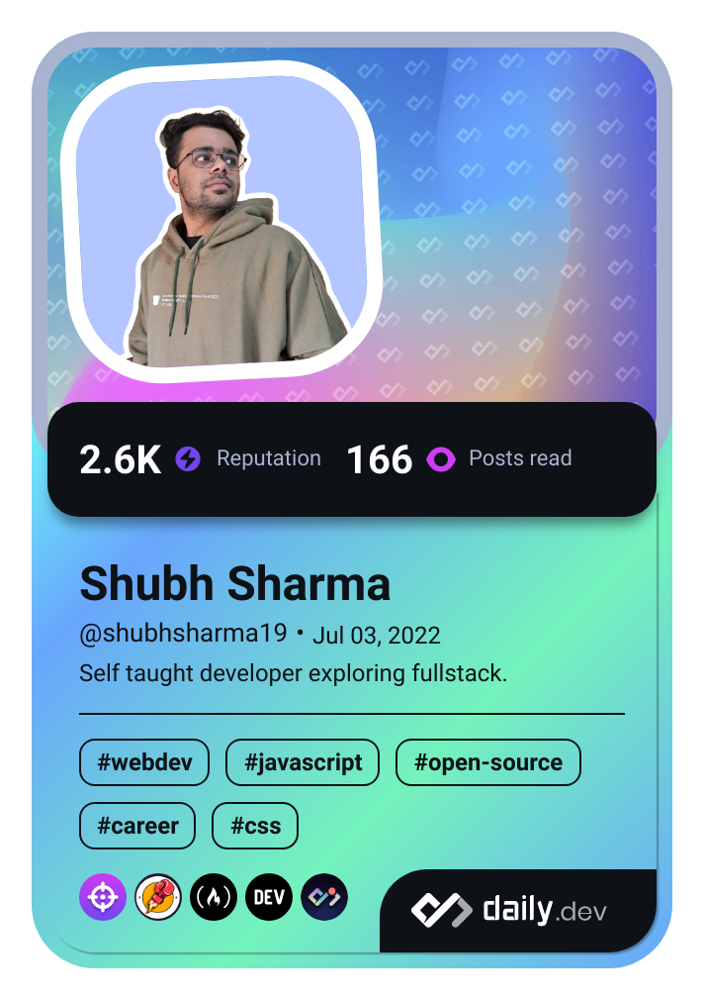

## Hi, I'm Shubh 👋

<!--  -->

<!-- Introduction -->
- 🖥 I'm a self-taught developer passionate about web development.
- 🚀 I'm learning **Full-stack** at the moment.
- 🐦 You will find me most active on twitter [@shubhstwt](https://twitter.com/shubhstwt)
- ✨ Short form programming content on instagram [@shubhsig](https;//instagram.com/shubhsig)
- ⚡ Funfacts about me: I love anime, coffee and learning new technologies.
- 🌈 Checkout my VSCode theme [lazyvim](https://marketplace.visualstudio.com/items?itemName=ShubhSharma.lazyvim-theme) in extensions manager

<!-- My Skills -->
## 📦 Technologies
**Frontend**: `React` `HTML` `CSS` `Sass` `Bootstrap` `Tailwind`

**Backend**: `Express` `NodeJS` `MongoDB` `Postgres` `Postman`

**Version Control**: `Git` `GitLab` `GitHub`

**Others**: `Figma` `Canva` `Notion` `Bash` `Linux` `Netlify`

## 📕 My Latest Blogs

<!-- BLOG-POST-LIST:START -->
- [DOM Manipulation: Accessing the Elements of the Webpage.](https://shubhsharma19.hashnode.dev/dom-accessing-the-elements)
- [Easiest Explanation of DOM, Even a 6 year old can understand](https://shubhsharma19.hashnode.dev/easiest-explanation-for-dom)
- [Async/Await in JavaScript with Easiest Explanation!](https://shubhsharma19.hashnode.dev/async-await-explained)
- [Promises in JavaScript for Beginners](https://shubhsharma19.hashnode.dev/promises-for-beginners)
- [Async programming in JavaScript](https://shubhsharma19.hashnode.dev/async-programming-in-js)
<!-- BLOG-POST-LIST:END -->

<!--  -->

## 📬 Contact 
For a quick response, DM me on [twitter](twitter.com/shubhstwt)
